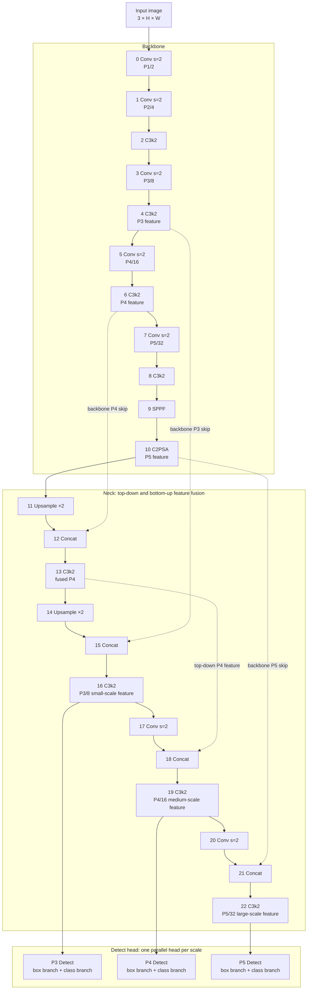

# CandyEye model architecture

This document describes the network currently built from
[`configs/yolo11.yaml`](configs/yolo11.yaml) by `core.candyeye.CandyEye`.
[`configs/yolo11_exchange.yaml`](configs/yolo11_exchange.yaml) is the same graph
with the optional exchange neck inserted before the head (see
[Optional exchange neck](#optional-exchange-neck)).
The configuration defines the layer graph; the `n` scale uses depth multiplier
`0.50` and width multiplier `0.25`. Dataset metadata can set the number of
classes (`nc`) when training starts.

## Network overview

## Feature sizes and channels

For an input of `H × W` pixels (dimensions divisible by 32), the three feature
maps are at strides 8, 16, and 32. At the configured `n` width, their channel
counts are 64, 128, and 256 respectively.

| Head level | Source layer | Stride | Feature map | Channels |
| --- | ---: | ---: | --- | ---: |
| P3, small objects | 16 | 8 | `H/8 × W/8` | 64 |
| P4, medium objects | 19 | 16 | `H/16 × W/16` | 128 |
| P5, large objects | 22 | 32 | `H/32 × W/32` | 256 |

## Detection head

Each of the three scales is processed by two separate branches:

- **Box branch (`cv2`)** predicts four distributions, one for each box side.
  The current `reg_max` is 16, so it outputs 64 channels per scale. DFL
  (Distribution Focal Loss) converts these distributions into box distances.
- **Class branch (`cv3`)** predicts one score per configured class, giving
  `nc` channels per scale. `nc` is read from the dataset YAML (`nc`, or the
  number of entries in `names`) by the training API.

During training, the head returns three raw maps with `64 + nc` channels each.
During evaluation, it decodes the box distributions, applies sigmoid to class
scores, and combines all three scales into one prediction tensor.

## Optional exchange neck

`configs/yolo11_exchange.yaml` appends one `ScaleExchange` layer (layer 23)
over `[16, 19, 22]` before Detect (layer 24). It treats P3/P4/P5 as interacting
groups: each adjacent pair passes a cheap depthwise message whose admission is
gated. The three gate modes are `none` (fixed 0.5), `static` (learnable
per-channel), and `dynamic` (computed from the feature maps). Input and output
are the same three feature maps, so it drops in without changing the head or
the channel counts. The MobileNet model exposes the same neck via
`neck: exchange`, `exchange_gate`, and `exchange_iters`.

The extra layer shifts Detect from index 23 to 24, so `core.convert_yolo11`'s
`remap_prefix` re-keys the official head weights when initializing from
`yolo11n.pth`.

## Main building blocks

- **Conv**: convolution, batch normalization, and SiLU activation.
- **C3k2**: CSP-style feature-processing block used throughout the backbone
  and neck.
- **SPPF**: pools features at multiple receptive-field sizes without changing
  the spatial resolution.
- **C2PSA**: attention block at the end of the backbone to mix spatial
  information.
- **Upsample and Concat**: combine coarse semantic features with finer
  backbone features in the neck.

The graph above follows the configured forward connections. The `n` scale
reduces the YAML base channels by `0.25` and scales repeated depth by `0.50`.
